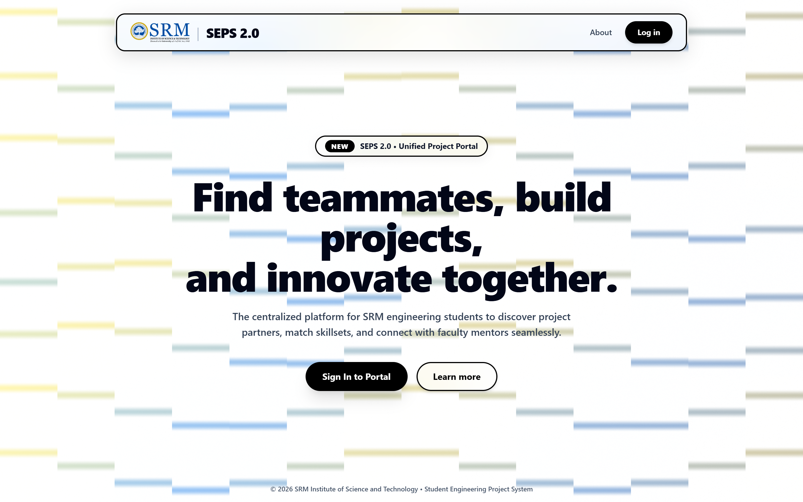
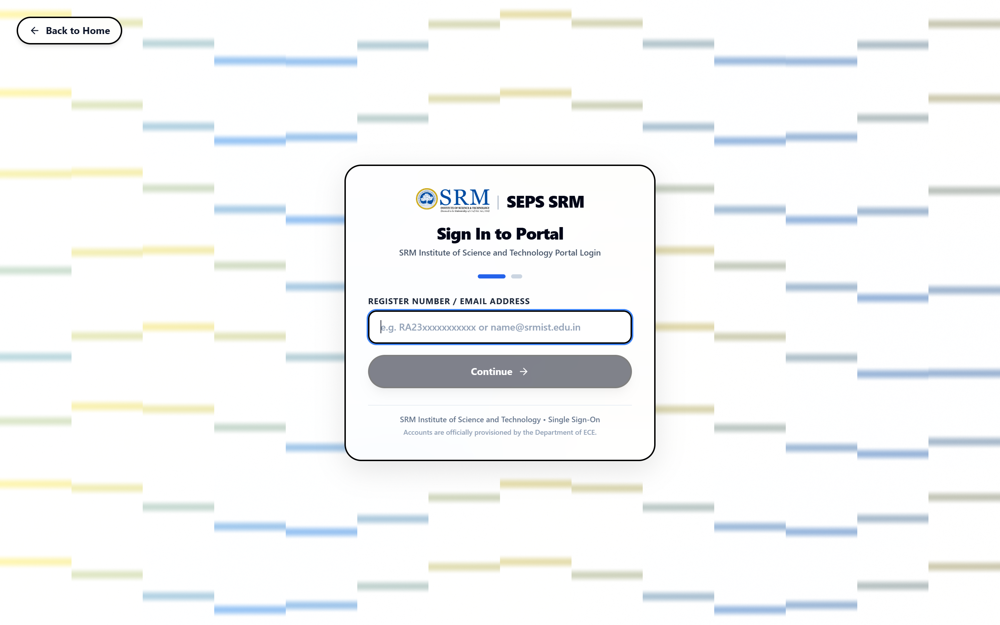
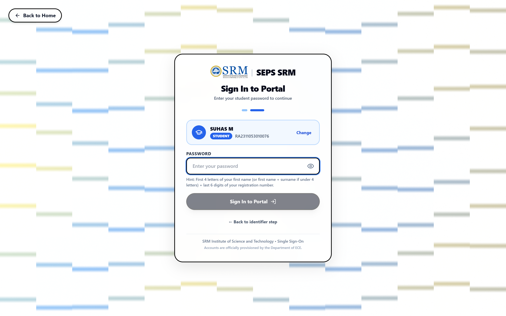
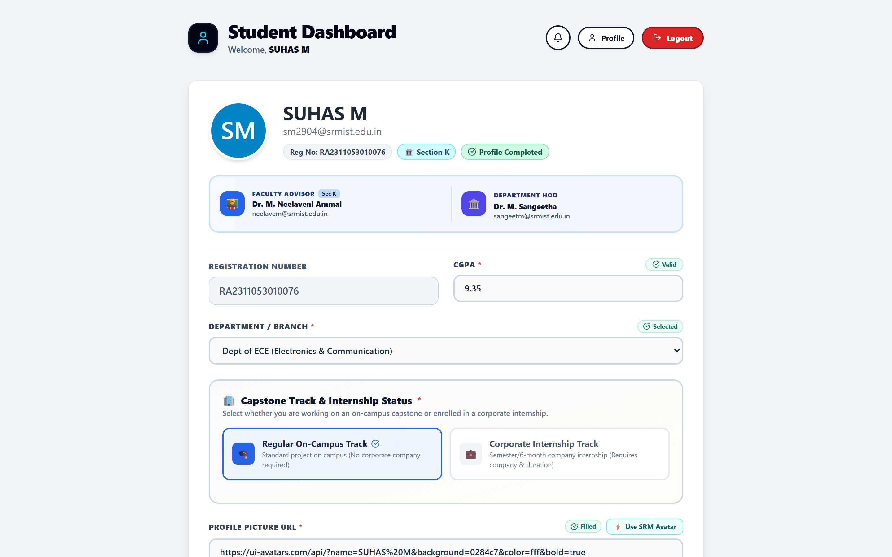
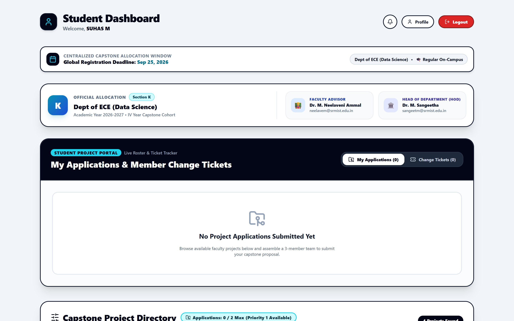
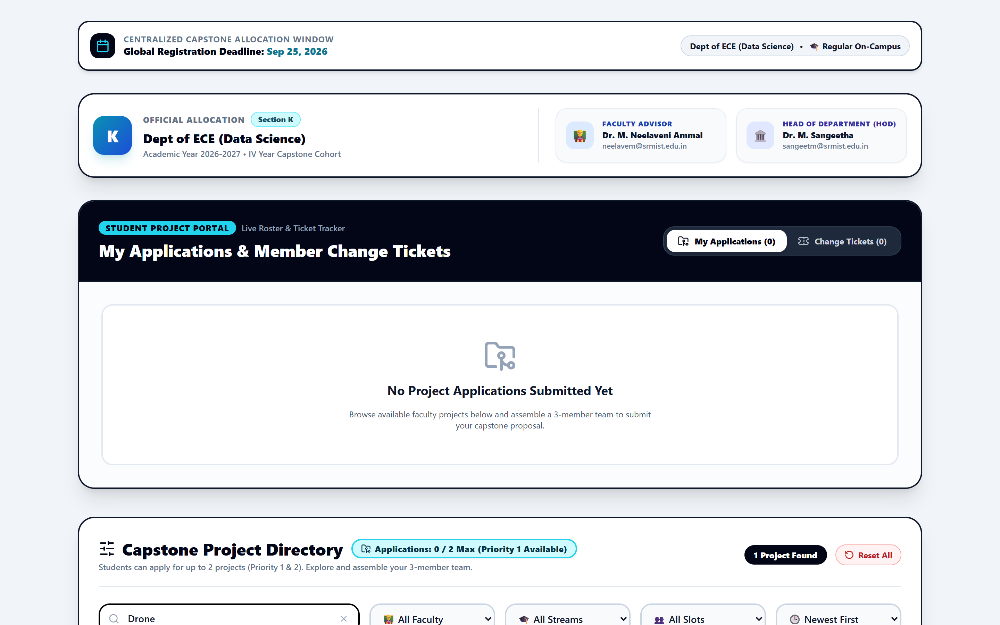
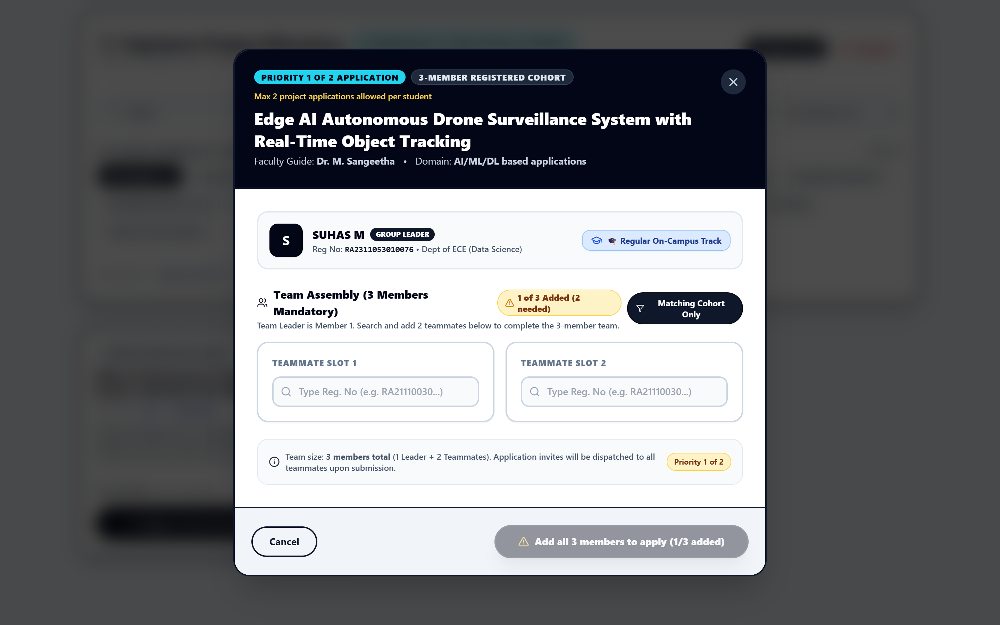
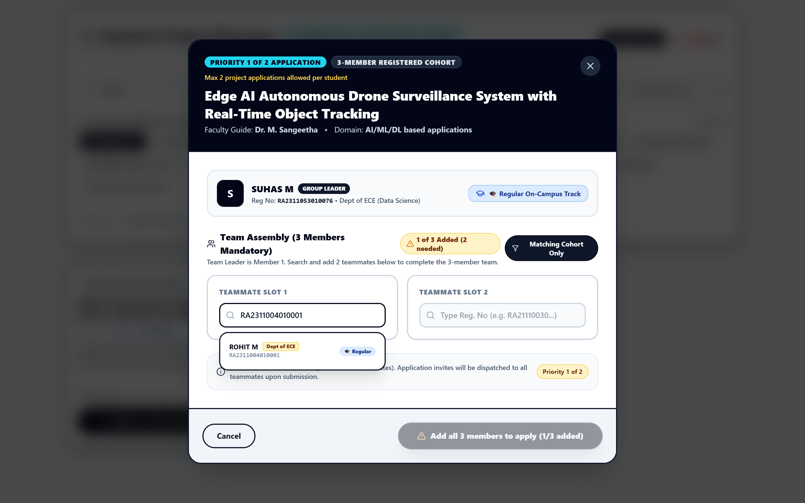
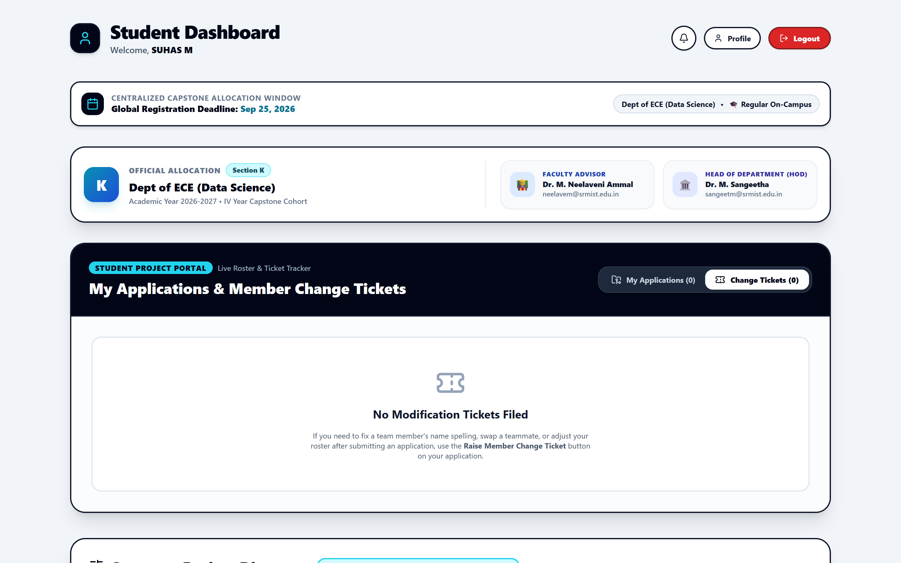
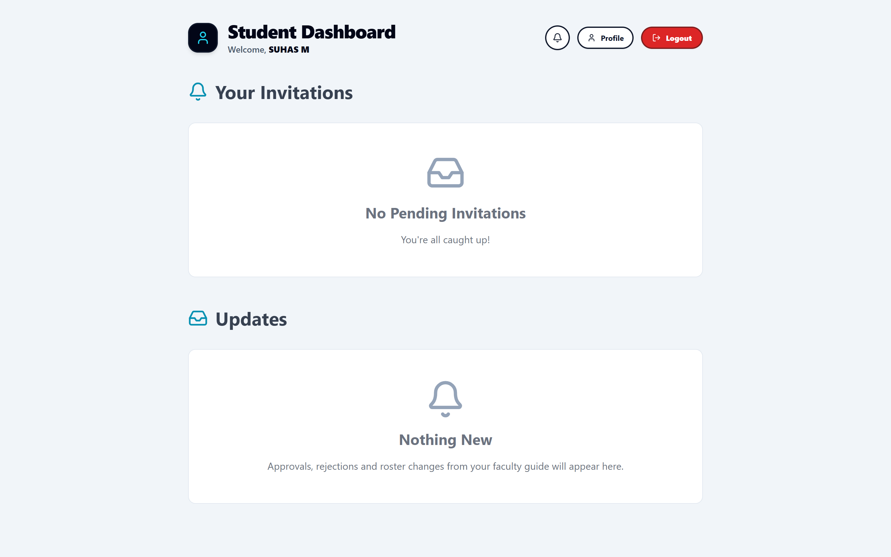

# Student Engineering Project System (SEPS)
## Student User Manual & Comprehensive Feature Guide
**Department of Electronics and Communication Engineering**  
**SRM Institute of Science and Technology, Kattankulathur**

---

## Table of Contents
1. [Introduction to SEPS](#1-introduction-to-seps)
2. [Getting Started & Authentication](#2-getting-started--authentication)
   - 2.1 Two-Step Authentication Flow
   - 2.2 Password Format & Security
3. [Student Profile Management](#3-student-profile-management)
   - 3.1 Mandatory Profile Verification
   - 3.2 Academic & Contact Details
   - 3.3 Portfolio Links & Resume
   - 3.4 Internship Status Declaration (Regular vs Corporate Track)
4. [Exploring Capstone Projects](#4-exploring-capstone-projects)
   - 4.1 Project Directory & Central Allocation Window
   - 4.2 Search & Domain-Specific Filters
   - 4.3 Understanding Project Cards (Stream Eligibility, Vacancies, Faculty Guides)
5. [Project Application Process](#5-project-application-process)
   - 5.1 Application Rules & Priorities (Priority 1 & Priority 2)
   - 5.2 Applying as Team Leader
   - 5.3 Building a Team & Adding Teammates
   - 5.4 Application Status Tracking
6. [Ticket Tracker & Dispute Resolution](#6-ticket-tracker--dispute-resolution)
   - 6.1 Raising Change Requests & Dispute Tickets
   - 6.2 Ticket Lifecycle & Department Approval
7. [Notifications Center](#7-notifications-center)
8. [Student Feature & Button Encyclopedia](#8-student-feature--button-encyclopedia)
9. [Frequently Asked Questions (FAQ) & Troubleshooting](#9-frequently-asked-questions-faq--troubleshooting)

---

## 1. Introduction to SEPS

The **Student Engineering Project System (SEPS)** is SRMIST’s official, centralized web platform engineered to automate, govern, and streamline the allocation and lifecycle management of final-year capstone engineering projects.

### Core Objectives:
- **Fair & Transparent Allocation**: Enforces strict merit, domain eligibility, and vacancy checks.
- **Team Synergy**: Supports multi-member team formation with cross-verification of member track eligibility.
- **Auditable Accountability**: Features built-in dispute resolution tickets routed through Faculty Advisors and Heads of Departments (HODs).
- **Streamlined Workflow**: Eliminates manual spreadsheets, paper forms, and uncoordinated guide assignments.

---

## 2. Getting Started & Authentication

SEPS employs a unified, secure **Two-Step Authentication Pipeline** that verifies institutional identity before prompting for authentication credentials.

*Figure 2.1: SEPS Landing Page with quick access to the portal.*

### 2.1 Two-Step Authentication Flow

#### Step 1: Identifier Entry
1. Navigate to the login portal at `/login` or click **Login** from the landing page.
2. In the **Register Number or Institutional Email** field, enter your official SRM student registration number (e.g., `RA2311053010076`).
3. Click **Continue to Next Step**.

*Figure 2.2: Login Step 1 – Entering Registration Number.*

#### Step 2: User Identification & Password Verification
1. Once your identifier is recognized, the portal displays your verified **Full Name**, **Department**, and a **Student** role badge.
2. Enter your confidential account password in the **Password** field.
3. Use the eye icon (`👁️`) on the right to toggle password visibility if needed.
4. Click **Log In to SEPS Dashboard**.

*Figure 2.3: Login Step 2 – Student identification banner and password input.*

### 2.2 Password Format & Security
- **Default Generated Password**: For existing students, the system initial password follows the formula:  
  `First 4 lowercase letters of First Name + Last 6 digits of Registration Number`  
  *Example*: For **SUHAS M** with registration number `RA2311053010076`, the password is `suha010076`.
- If your first name has fewer than 4 letters, letters from your surname are concatenated to complete the 4-character prefix.

---

## 3. Student Profile Management

Upon your first login, SEPS requires a **Profile Completion Gate**. Students cannot apply for projects or form teams until their profile is 100% complete and validated.

*Figure 3.1: Student Profile page displaying academic records, links, and internship track settings.*

### 3.1 Mandatory Profile Verification
The system enforces strict data formatting for all students:
- **CGPA**: Must be a valid numerical value between `0.01` and `10.00` (up to two decimal places, e.g., `9.35`).
- **Department**: Verified against official institutional records (e.g., `Dept of ECE (Data Science)`).
- **Profile Picture**: Valid image URL (defaults to institutional avatar).

### 3.2 Academic & Contact Details
- Verify your Section allocation (e.g., `Section K`), Faculty Advisor (`Dr. M. Neelaveni Ammal`), and HOD (`Dr. M. Sangeetha`).
- Contact support immediately if your departmental branch or section assignment is incorrect.

### 3.3 Portfolio Links & Resume
To assist prospective faculty guides during proposal review, you must supply active URLs:
- **LinkedIn Profile**: Full URL (`https://linkedin.com/in/your-username`).
- **GitHub Repository Profile**: Direct link to your code repositories (`https://github.com/your-username`).
- **Resume URL**: Publicly viewable Google Drive or cloud link to your latest CV/Resume.

### 3.4 Internship Status Declaration (Cohort Track)
Students are segregated into two distinct academic cohorts:
1. **Regular (On-Campus)**: Attending campus capstone laboratories and regular project reviews.
2. **Corporate Internship (6-Month Off-Campus)**: Completing external industry training (e.g., Qualcomm, Amazon, Philips).
   - Requires **Internship Company Name** (e.g., `Qualcomm India`).
   - Requires **Internship Duration** (e.g., `6 Months (Jan - Jun 2026)`).

> [!WARNING]
> **Cohort Mismatch Rule**: A team cannot combine students from the Regular track and the Corporate Internship track. All members of an applying team must belong to the same cohort track.

---

## 4. Exploring Capstone Projects

Once your profile is verified, you are redirected to the **Student Dashboard** (`/student-dashboard`).

*Figure 4.1: Student Dashboard featuring centralized deadline, domain filters, and live project cards.*

### 4.1 Project Directory & Central Allocation Window
- **Centralized Allocation Banner**: Displays the active registration window deadline (e.g., `Global Registration Deadline: Sep 25, 2026`).
- **Roster & Section Cards**: Outlines your section advisor and head of department.
- **Applications Status Counter**: Shows your active submissions (up to a maximum of 2 applications).

### 4.2 Search & Domain-Specific Filters
- **Live Search Bar**: Type keywords (e.g., `Drone`, `LoRaWAN`, `TinyML`, `Antenna`) to instantaneously filter titles, descriptions, and faculty names.
- **Domain Filter Pills**: Click any domain tag (e.g., `AI/ML/DL based applications`, `Embedded Systems and IoT`, `Wireless Communication`) to isolate projects in that domain.

*Figure 4.2: Real-time keyword filtering narrowing project directory to matching capstones.*

### 4.3 Understanding Project Cards
Each project listing contains critical information:
- **Domain Tag**: Top badge denoting technological field.
- **Vacancies Counter**: Number of team slots remaining (e.g., `1 Vacancy`).
- **Project Title**: Formal title of the approved capstone proposal.
- **Eligible Streams**: Lists authorized academic programs (e.g., `ECE`, `All Branches`).
- **Description**: Detailed abstract, target hardware, and technical scope.
- **Faculty Guide**: Name and cabin contact of the proposing professor.
- **Action Button**: Primary button to trigger the application modal.

---

## 5. Project Application Process

### 5.1 Application Rules & Priorities
- **Maximum Applications**: Each student can submit up to **2 project applications**.
- **Priority System**:
  - First application submitted is designated **Priority 1** (Top Choice).
  - Second application submitted is designated **Priority 2** (Alternative Choice).
- **Single Allocation**: As soon as a faculty guide accepts your application, your team is permanently allocated, and all other pending applications are automatically retracted.

### 5.2 Applying as Team Leader
To apply for a project:
1. Locate the desired project card on your dashboard.
2. Click the black **Apply as Team Leader (Priority X)** button.
3. The **Project Application Modal** will open.

*Figure 5.1: Project Application Modal showing guide details, capacity, and project abstract.*

### 5.3 Building a Team & Adding Teammates
Capstone projects at SRM require collaborative execution:
1. In the Application Modal, review your role as the **Team Leader**.
2. Enter each teammate’s official SRM **Registration Number** into the member field.
3. Click **Verify & Add Member**.
4. The system validates:
   - Whether the student is already part of another approved team.
   - Whether the student's cohort matches (Regular vs Corporate).
   - Whether the student meets departmental stream criteria.
5. Once your team roster is assembled, enter an optional **Proposal Pitch / Cover Note** summarizing your team's relevant skills and motivation.
6. Click **Submit Application**.

*Figure 5.2: Adding team members with real-time institutional verification.*

---

## 6. Ticket Tracker & Dispute Resolution

SEPS includes a formal grievance and change management mechanism.

*Figure 6.1: Ticket Tracker Widget displaying active tickets and resolution states.*

### 6.1 Raising Change Requests & Dispute Tickets
Students can initiate formal tickets for:
- **Change of Guide**: Requesting a transfer of mentorship under documented mutual consent.
- **Project Title / Scope Modification**: Minor changes in technical deliverables.
- **Team Reconstitution**: Replacement or withdrawal of an inactive team member.

### 6.2 Ticket Lifecycle & Approval Chain
1. **Submitted**: Ticket logged with timestamps and student justification.
2. **Faculty Advisor Review**: Initial screening by the student's Section Faculty Advisor.
3. **HOD Final Endorsement**: Official sign-off by the Head of Department.
4. **Resolved**: Database allocation updated automatically upon approval.

---

## 7. Notifications Center

The **Notifications Center** (`/notifications`) tracks every system event relevant to your account.

*Figure 7.1: Notifications feed with status badges and timestamped alerts.*

### Types of Notifications:
- **Application Decision Alerts**: Real-time notice when a faculty guide **Accepts** or **Rejects** your proposal.
- **Team Invitations**: Alerts when a fellow student adds you to their proposed project group.
- **Ticket Status Updates**: Progress reports on your change request tickets.
- **Deadline Reminders**: Institutional announcements regarding phase submissions.

---

## 8. Student Feature & Button Encyclopedia

| Screen / Component | Element Name | Element Type | Icon / Visual | Function & Behavior |
|---|---|---|---|---|
| **Global Navbar** | Portal Logo / Title | Link | SRM Emblem | Navigates to `/student-dashboard`. |
| **Global Navbar** | My Applications | Button | Clipboard Icon | Opens drawer showing submitted applications and priority ranks. |
| **Global Navbar** | Change Tickets | Button | Ticket Icon | Opens the Ticket Management modal to raise or review disputes. |
| **Global Navbar** | Notifications Bell | Button | Bell Icon | Navigates to `/notifications`; shows unread badge counter. |
| **Global Navbar** | Profile | Button | User Avatar | Navigates to `/student-profile`. |
| **Global Navbar** | Logout | Button | LogOut Icon | Terminates active session, clears cookies, redirects to `/login`. |
| **Student Dashboard**| Search Input | Text Field | Search Glass | Filters project cards in real-time by title, abstract, or guide. |
| **Student Dashboard**| Domain Chips | Button Group | Tag Pills | Filters listings by specific technological discipline. |
| **Student Dashboard**| Clear Filters | Button | RotateCcw Icon | Resets search query and domain chips to show all available listings. |
| **Student Dashboard**| Refresh Directory | Button | RefreshCw Icon | Re-queries the database for newly approved faculty projects. |
| **Project Card** | Apply as Team Leader | Button | Send Icon | Launches the Application Modal for the chosen capstone topic. |
| **Project Card** | Applied (Priority X) | Status Badge | Green Checkmark| Disabled state indicating application is already submitted. |
| **Project Card** | Application Limit Reached | Disabled Badge| Lock Icon | Indicates student has exhausted the maximum limit of 2 applications. |
| **Apply Modal** | Add Teammate | Button | Plus Icon | Appends an additional registration number field for team expansion. |
| **Apply Modal** | Submit Application | Button | Send Icon | Submits the team proposal to the faculty guide for formal review. |
| **Apply Modal** | Close / Cancel | Button | X Icon | Discards current inputs and dismisses the application dialog. |
| **Student Profile** | Edit Profile | Button | Edit3 Icon | Unlocks editable fields for CGPA, skills, links, and internship data. |
| **Student Profile** | Save Changes | Button | Check Icon | Validates form fields and commits profile updates to TiDB. |
| **Ticket Widget** | New Ticket | Button | PlusCircle | Launches the Change Ticket creation modal. |

---

## 9. Frequently Asked Questions (FAQ) & Troubleshooting

### Q1: Why does the dashboard say "Application Limit Reached"?
**A:** Institutional policy restricts each student to a maximum of **2 simultaneous project applications** (Priority 1 and Priority 2). If both are pending, you must wait for a faculty decision or withdraw an unreviewed proposal.

### Q2: Why is my teammate getting an error when I enter their Registration Number?
**A:** Common reasons include:
1. The teammate has already been accepted into another approved team.
2. Cohort mismatch (e.g., you are Regular on-campus and your teammate is registered for 6-Month Corporate Internship).
3. The teammate has not completed their mandatory profile verification.

### Q3: How do I change my password?
**A:** Navigate to your **Profile** page and locate the Account Security section, or contact your Section Faculty Advisor for a secure administrative PIN reset.

### Q4: What happens after my application is accepted?
**A:** As soon as a faculty guide clicks **Accept**, your team status transitions to **Allocated**. You will receive an immediate confirmation notification, and your project will appear under your active capstone roster.
