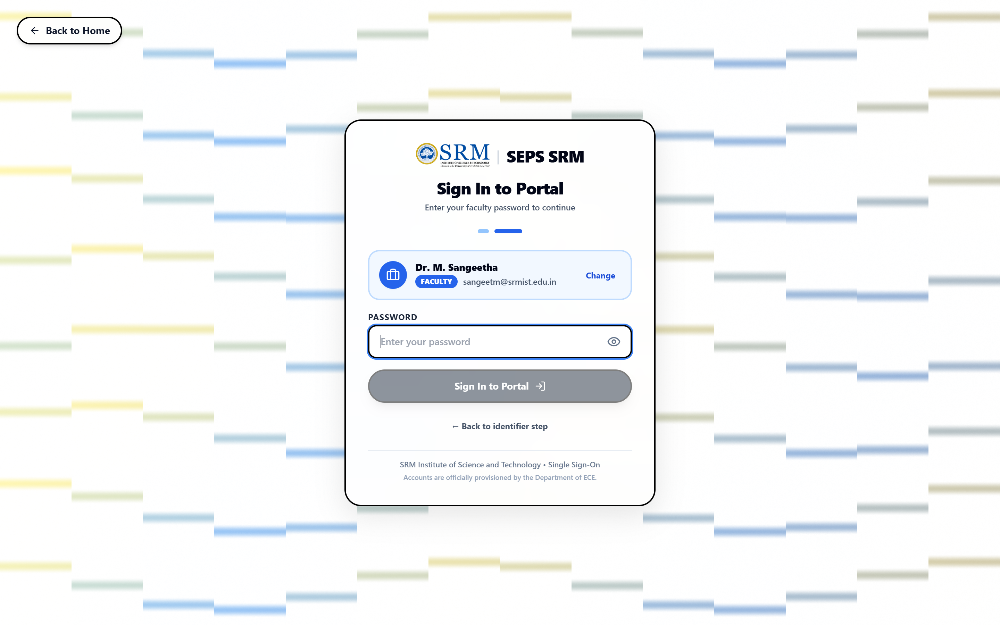
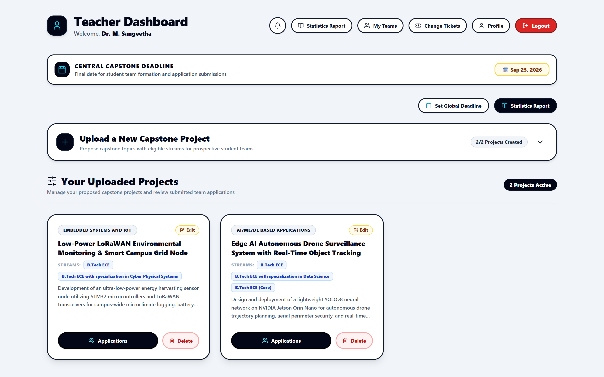
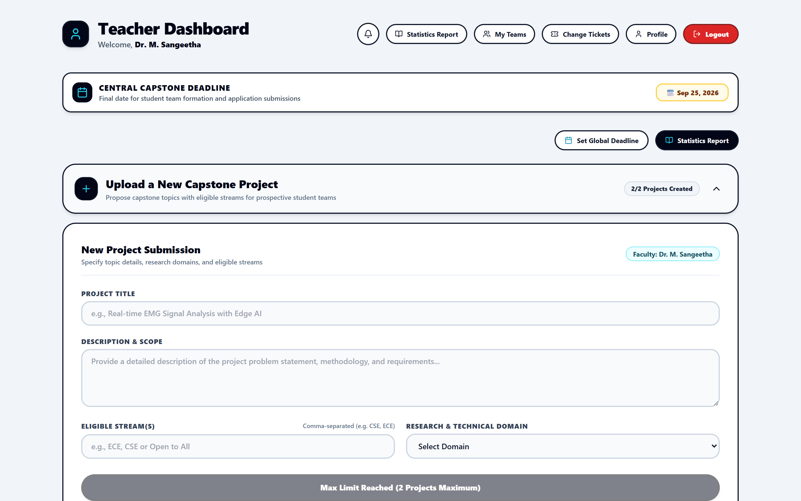
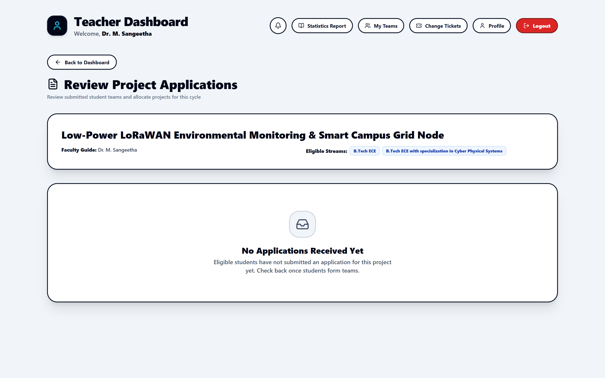
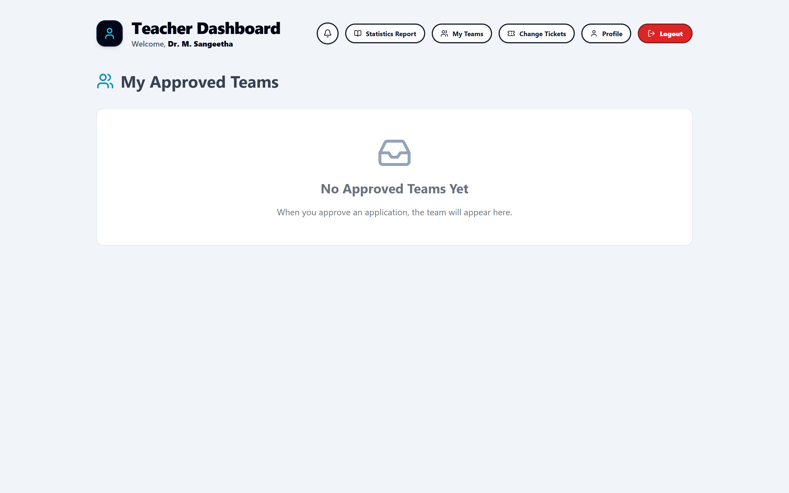
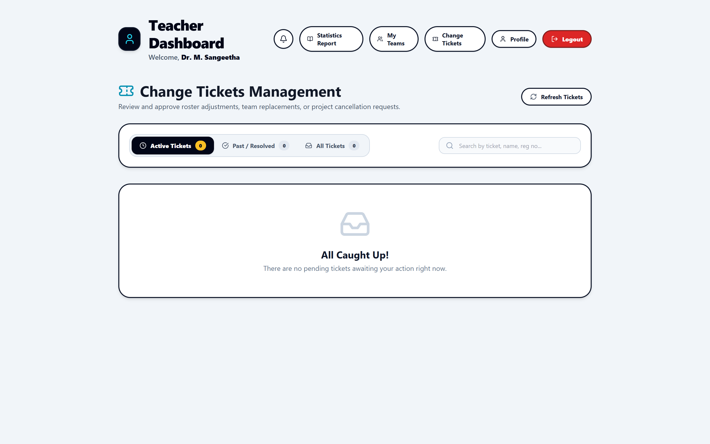
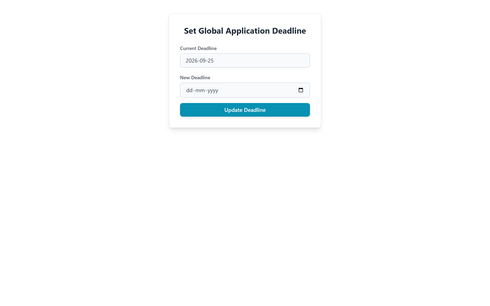
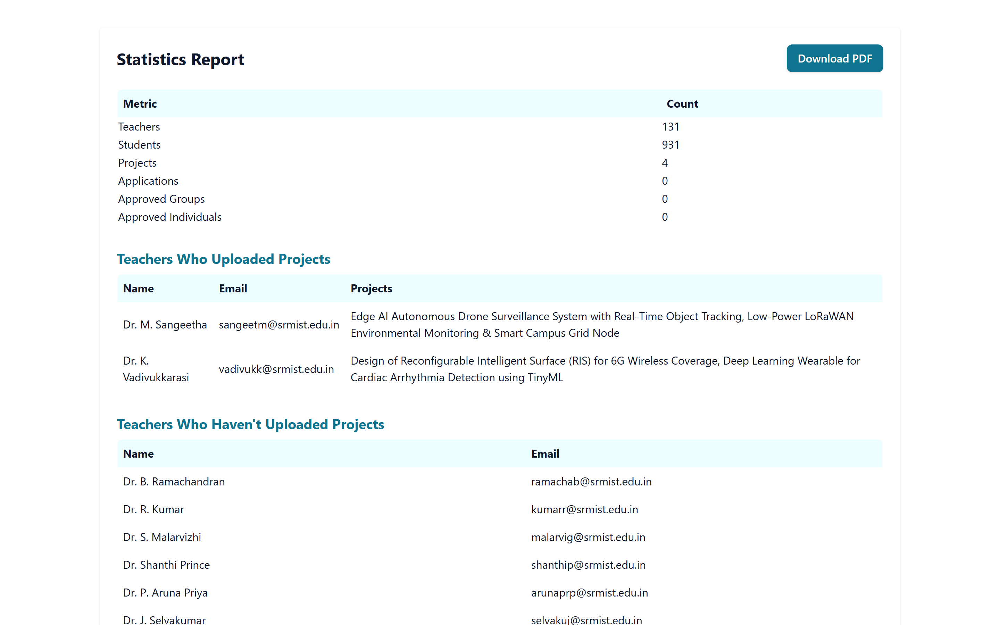
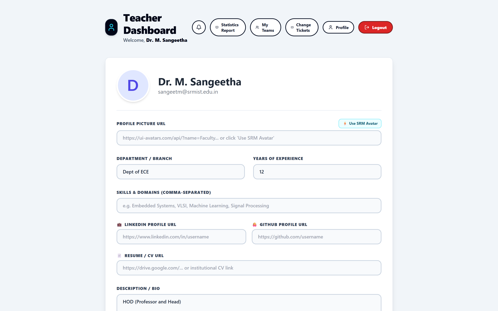

# Student Engineering Project System (SEPS)
## Faculty & Guide User Manual & Comprehensive Administration Guide
**Department of Electronics and Communication Engineering**  
**SRM Institute of Science and Technology, Kattankulathur**

---

## Table of Contents
1. [Introduction to Faculty Capabilities](#1-introduction-to-faculty-capabilities)
2. [Faculty Authentication & Account Access](#2-faculty-authentication--account-access)
3. [Teacher Dashboard Overview](#3-teacher-dashboard-overview)
   - 3.1 Allocation Statistics & Metric Cards
   - 3.2 Central Capstone Deadline Banner
   - 3.3 Active Projects Grid
4. [Proposing & Uploading Capstone Projects](#4-proposing--uploading-capstone-projects)
   - 4.1 Project Upload Form Parameters
   - 4.2 Eligible Streams & Interdisciplinary Filtering
   - 4.3 Technical Domains & Prerequisites
5. [Reviewing Student Applications & Team Allotment](#5-reviewing-student-applications--team-allotment)
   - 5.1 Accessing the Applicant Roster
   - 5.2 Evaluating Student Credentials (CGPA, Track, Resume)
   - 5.3 Acceptance & Rejection Workflow
   - 5.4 Automatic Allocation & Lockout Rules
6. [Managing Allocated Teams (My Teams)](#6-managing-allocated-teams-my-teams)
7. [Ticket Resolution & Change Requests](#7-ticket-resolution--change-requests)
8. [Departmental Coordinator Controls](#8-departmental-coordinator-controls)
   - 8.1 Setting Global Allocation Deadlines
   - 8.2 Statistics Reports & Analytical Exports
9. [Faculty Profile Management](#9-faculty-profile-management)
10. [Teacher Feature & Button Encyclopedia](#10-teacher-feature--button-encyclopedia)
11. [Frequently Asked Questions (FAQ) & Guide Best Practices](#11-frequently-asked-questions-faq--guide-best-practices)

---

## 1. Introduction to Faculty Capabilities

The **Student Engineering Project System (SEPS)** empowers faculty members and project coordinators to manage final-year engineering capstone projects with clarity, integrity, and efficiency.

### Key Capabilities for Faculty Guides:
- **Propose & Edit Projects**: Define rigorous project descriptions, prerequisites, and branch eligibility.
- **Vet Student Applicants**: Review student transcripts (CGPA), GitHub repositories, portfolios, and cohort tracks before granting approval.
- **Automated Capacity Control**: Protect guides from over-allocation; automatically closes projects once the sanctioned student team is approved.
- **Grievance Handling**: Adjudicate dispute and guide-change requests with tracked audit trails.
- **Coordination & Reporting**: For designated coordinators, manage institutional submission deadlines and generate department-wide analytics.

---

## 2. Faculty Authentication & Account Access

Faculty access is governed through authenticated institutional email verification and unique security credentials.

*Figure 2.1: Step 1 – Entering official institutional email address.*

### Login Procedure:
1. Navigate to `/login`.
2. In the identifier field, input your official SRM email address (e.g., `sangeetm@srmist.edu.in`).
3. Click **Continue to Next Step**.
4. The system identifies your profile, displaying your **Designation**, **Full Name**, and **Faculty** role badge.
5. Enter your assigned 8-digit numeric security PIN or password.
6. Click **Log In to SEPS Dashboard**.

*Figure 2.2: Step 2 – Faculty identification screen with password prompt.*

---

## 3. Teacher Dashboard Overview

Upon logging in, the **Teacher Dashboard** (`/teacher-dashboard`) provides a command center for all your capstone supervisory activities.

*Figure 3.1: Teacher Dashboard displaying deadline banner, coordinator controls, and project roster.*

### 3.1 Allocation Statistics & Metric Cards
At a glance, the dashboard summarizes your current supervisory workload:
- **Total Projects Proposed**: Number of active project topics posted under your mentorship.
- **Pending Applications**: Number of student teams currently awaiting your review.
- **Approved Teams**: Number of student teams officially locked and allocated to your lab.

### 3.2 Central Capstone Deadline Banner
A prominent notification banner showcases the active departmental deadline (e.g., `Central Capstone Deadline: Sep 25, 2026`), informing faculty when student submissions will automatically conclude.

### 3.3 Coordinator Controls
For Department Coordinators and HODs, executive buttons are displayed at the top right:
- **Set Global Deadline**: Configure cutoff timestamps for student submissions.
- **Statistics Report**: Generate department-wide allocation analytics.

---

## 4. Proposing & Uploading Capstone Projects

Faculty can propose projects tailored to their research laboratory or industrial consultancy.

*Figure 4.1: Collapsible Project Upload Form with stream selection and domain categorization.*

### 4.1 Step-by-Step Project Creation:
1. Click the banner **Upload a New Capstone Project** on your dashboard to expand the form.
2. **Project Title**: Enter a descriptive, academic title (e.g., *Edge AI Autonomous Drone Surveillance System*).
3. **Project Abstract & Description**: Provide a thorough technical summary detailing the problem statement, methodologies, expected hardware/software stacks, and deliverables.
4. **Allowed Academic Streams**: Select the eligible student programs:
   - `B.Tech ECE (Core)`
   - `B.Tech ECE with specialization in Cyber Physical Systems`
   - `B.Tech ECE with specialization in Data Science`
   - `All Streams`
5. **Technical Domain**: Categorize the project under approved IEEE/department domains (e.g., *AI/ML/DL based applications*, *Embedded Systems and IoT*, *Antenna design and RF systems*).
6. **Maximum Team Capacity**: Define the maximum allowable team size (typically 1 to 4 members).
7. Click **Publish Capstone Project**.

---

## 5. Reviewing Student Applications & Team Allotment

When student teams submit proposals for your projects, they are queued for your review.

*Figure 5.1: Applications Review portal listing applicant teams and student profile details.*

### 5.1 Accessing the Applicant Roster
1. On your dashboard, locate the specific project card.
2. Click **View Applications**.
3. You are redirected to the dedicated review screen (`/teacher/project-applications/:projectId`).

### 5.2 Evaluating Student Credentials
Each applicant card displays:
- **Team Leader & Members**: Names and official Registration Numbers.
- **Academic Merit (CGPA)**: Live academic CGPA of all members.
- **Cohort Track**: Visual badge distinguishing **Regular On-Campus** from **Corporate Internship** students.
- **Portfolio Links**: Direct links to student Resumes, GitHub profiles, and LinkedIn.
- **Proposal Note**: The students' written pitch detailing relevant coursework and motivation.

### 5.3 Acceptance & Rejection Workflow
- **To Accept**: Click the green **Accept Team** button.
  - The team is immediately allocated to your project.
  - A confirmation email and system notification are dispatched to all team members.
  - The project card status updates to **Allocated (Closed)**, preventing any further student applications.
- **To Reject**: Click the red **Decline Application** button.
  - The students are notified and their application slot is freed to apply for alternative projects.

---

## 6. Managing Allocated Teams (My Teams)

Navigate to `/teacher/my-teams` to oversee all student groups formally assigned under your guidance.

*Figure 6.1: My Teams portal detailing members, contact information, and project phases.*

### Features:
- Complete student roster with official institutional contact information.
- Milestone tracking for Phase 1 Review, Phase 2 Review, and Final Capstone Defense.
- Direct quick-links to student documentation and progress repositories.

---

## 7. Ticket Resolution & Change Requests

The **Teacher Tickets** portal (`/teacher/tickets`) handles student disputes and administrative modifications.

*Figure 7.1: Tickets management screen for processing guide-change and team dispute requests.*

### Adjudication Steps:
1. Review the student's stated grievance or request rationale.
2. Inspect recommendations from the Section Faculty Advisor.
3. Select **Approve Request** or **Reject Request** and append faculty commentary.

---

## 8. Departmental Coordinator Controls

### 8.1 Setting Global Allocation Deadlines
Accessed via `/teacher/set-global-deadline` (available to department coordinators).

*Figure 8.1: Centralized calendar interface for setting institutional submission cutoffs.*

- Allows administrators to select the exact cutoff date and time.
- Locks the student submission portal across all batches when the deadline expires.

### 8.2 Statistics Reports & Analytical Exports
Accessed via `/teacher/statistics-report`.

*Figure 8.2: Department-wide statistics report with visual metrics and PDF export options.*

- **Total Allocation Rate**: Percentage of students successfully matched with guides.
- **Domain Distribution**: Bar and pie representations of student interests across AI/ML, IoT, VLSI, and RF.
- **Export to PDF**: One-click download of the complete departmental roster for accreditation (NBA / NAAC) audits.

---

## 9. Faculty Profile Management

Accessed via `/teacher-profile`.

*Figure 9.1: Faculty Profile displaying cabin details, research specializations, and contact info.*

- Maintain updated cabin location (e.g., *Tech Park 8th Floor, TP804*).
- Highlight key research specializations and active laboratory facilities to attract high-caliber student teams.

---

## 10. Teacher Feature & Button Encyclopedia

| Screen / Component | Element Name | Element Type | Icon / Visual | Function & Behavior |
|---|---|---|---|---|
| **Global Navbar** | Portal Logo | Link | SRM Emblem | Navigates to `/teacher-dashboard`. |
| **Global Navbar** | My Teams | Button | Users Icon | Navigates to `/teacher/my-teams` to monitor allocated students. |
| **Global Navbar** | Tickets | Button | AlertCircle | Navigates to `/teacher/tickets` with unread pending counter. |
| **Global Navbar** | Notifications | Button | Bell Icon | Navigates to `/notifications` with administrative alerts. |
| **Global Navbar** | Profile | Button | User Avatar | Navigates to `/teacher-profile`. |
| **Global Navbar** | Logout | Button | LogOut Icon | Ends authenticated session and returns to login screen. |
| **Teacher Dashboard**| Upload New Project | Collapsible Banner | Plus Icon | Expands/collapses the new capstone proposal form. |
| **Teacher Dashboard**| Set Global Deadline| Button | Calendar Icon | *(Coordinators only)* Navigates to deadline configuration. |
| **Teacher Dashboard**| Statistics Report | Button | BookOpen Icon | *(Coordinators only)* Navigates to department analytics. |
| **Project Card** | View Applications | Button | Eye / Users | Opens the applicant review list for that specific project. |
| **Project Card** | Edit Project | Button | Edit3 Icon | Opens the project modification dialog to update parameters. |
| **Project Card** | Delete Project | Button | Trash2 Icon | Prompts confirmation modal to permanently delete proposal. |
| **Applications Review**| Accept Team | Button | CheckCircle | Confirms allocation, updates status to Allocated, locks project. |
| **Applications Review**| Decline Application| Button | XCircle | Rejects proposal and releases students to apply elsewhere. |
| **Tickets Screen** | Approve Ticket | Button | ThumbsUp | Endorses student change request and updates records. |
| **Tickets Screen** | Reject Ticket | Button | ThumbsDown | Declines change request with obligatory faculty rationale. |
| **Statistics Screen**| Export to PDF | Button | Download Icon | Compiles live departmental stats into an audit-ready PDF. |

---

## 11. Frequently Asked Questions (FAQ) & Guide Best Practices

### Q1: Can I guide more projects than the departmental quota?
**A:** The system enforces a default limit of **2 capstone teams per faculty member** to maintain balanced supervisory loads across the department. Contact the HOD if an exception is warranted for sponsored industrial projects.

### Q2: What happens if two high-scoring teams apply for my project simultaneously?
**A:** Both teams appear in your review queue. You have full academic autonomy to review member skills, resumes, and project pitches before selecting the team best suited for the topic.

### Q3: How do I edit a project topic after publishing?
**A:** Locate the project on your dashboard and click **Edit Project**. You can revise descriptions, prerequisites, or stream eligibility at any time prior to team allocation.
